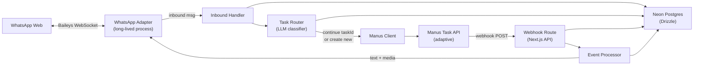

# Manus + WhatsApp Adapter Plan (Next.js 16 + Neon)

## 0) Execution State (Jira-Style)

Last updated: 2026-02-15
Current release gate: **F12 Admin Console — Self-Service Setup & DB-Backed Config**
Status: **F1-F9 complete; F11 Phase 1 OSS complete; F12 complete (admin console + DB config + channel management + tunnel + guide + status)**

### Release Log

| Release | Scope | Status | Notes |
|---|---|---|---|
| F1 | Project scaffold + Neon/Drizzle foundation + env validation + migration baseline | ✅ Done | User QA passed |
| F2 | WhatsApp adapter + inbound normalization | ✅ Done | User QA passed |
| F3 | Manus client + task creation + acknowledgment | ✅ Done | User QA passed |
| F4 | Task router (continue vs new) | ✅ Done | User QA passed |
| F5 | Manus webhook + event processor + outbound | ✅ Done | User QA passed |
| F6 | Ops hardening + read APIs | ✅ Done | User QA passed |
| F7 | Baileys bootstrap + integration tests | ✅ Done | Instrumentation wiring + 5 integration tests against Neon |
| F8 | Decouple WhatsApp setup + chat targeting | 🔧 In Progress | Separate auth/setup CLIs, bot-config.json, message filtering with name/mention triggers. See `f8-whatsapp-setup-chat-targeting.md` |
| F9 | Runtime stabilization + webhook delivery reliability | ✅ Done | Routing fallback on classifier/continue failures, webhook registration script + callback path hardening, global runtime adapter + bootstrap recovery, outbound chunking, provider-verified stale cleanup. See `f9-runtime-stabilization-webhook-delivery.md` |
| F11 | OSS core + managed SaaS authn/authz (multi-user enterprise) | ✅ OSS Phase 1 Complete | Workspace-scoped schema shipped for OSS (`workspaces` + `workspace_id` across domain tables), default workspace seeding/backfill migration generated, and store-layer scoping wired. Managed authn/authz phases remain planned. See `f11-oss-managed-multi-tenant-auth.md` |
| F12 | Admin console — self-service setup, channel management & DB-backed config | ✅ Done | All 4 phases complete: DB settings UI, WhatsApp in-browser pairing/config, Cloudflare tunnel manager + webhook auto-registration, setup guide wizard + status dashboard. See `f12-admin-console-db-config.md` |

### Work Items

| Key | Title | Status | Deliverables |
|---|---|---|---|
| MWA-1 | Bootstrap Next.js 16 app | ✅ Done | New app created at `agent-7` |
| MWA-2 | Add Neon + Drizzle tooling | ✅ Done | Drizzle config + schema + generated migration |
| MWA-3 | Add environment validation | ✅ Done | Zod-based env parser with required keys and defaults |
| MWA-4 | Add baseline tests for foundation | ✅ Done | Vitest setup + env + schema unit tests |
| MWA-5 | Implement WhatsApp adapter (text/media/typing) | ✅ Done | `BaileysWhatsAppAdapter` with queue + media kind routing |
| MWA-6 | Implement inbound task routing pipeline | ✅ Done | Normalize/dedupe + router + continue/new dispatch orchestration |
| MWA-7 | Implement Manus client (create/continue/get + retries) | ✅ Done | `ManusClient` with adaptive defaults, timeout, retry backoff, request correlation id |
| MWA-8 | Wire inbound to task creation + acknowledgment | ✅ Done | Task row persistence, inbound message linkage, WhatsApp ack send + outbound message log |
| MWA-9 | Implement task router short-circuits + LLM classifier path | ✅ Done | No-active and single-waiting short-circuit + JSON LLM decision parser |
| MWA-10 | Persist routing decisions and query active tasks from DB | ✅ Done | Drizzle store for route persistence and active task listing |
| MWA-11 | Implement Manus webhook route + idempotent event ingest | ✅ Done | Dynamic secret route + webhook event dedupe + process status updates |
| MWA-12 | Implement event processor for created/progress/stopped | ✅ Done | Task lifecycle updates + finish/ask outbound handling + attachment forwarding |
| MWA-13 | Implement continue-task dispatch orchestration | ✅ Done | Router-driven continue path + `waiting_user -> running` task transition helper |
| MWA-14 | Add concrete router LLM runtime wiring + safe fallback | ✅ Done | OpenAI-compatible completion client + env-driven router factory + deterministic fallback |
| MWA-15 | Harden webhook ACK path + out-of-order progress handling | ✅ Done | Async webhook processing via Next.js `after()` + ignore late progress after stop/fail |
| MWA-16 | Add cleanup + stale task timeout ops endpoint | ✅ Done | `/api/internal/cleanup` with TTL batch deletes + stale task fail/notify |
| MWA-17 | Add internal read endpoints for sessions/tasks | ✅ Done | `/api/sessions/[id]` and `/api/tasks/[taskId]` protected by internal token |
| MWA-18 | Add inbound rate limiting utility | ✅ Done | Sliding-window limiter + inbound handler integration + tests |
| MWA-19 | Add Baileys bootstrap via Next.js instrumentation | ✅ Done | `src/instrumentation.ts` + `src/lib/channel/whatsapp-bootstrap.ts` — boots Baileys on server start, wires inbound → dispatch → Manus, registers runtime adapter |
| MWA-20 | Add integration tests against real Neon DB | ✅ Done | `src/integration/full-flow.integration.test.ts` — 5 scenarios: full finish, ask/continue, webhook idempotency, inbound dedupe, session upsert |
| MWA-21 | Externalize Baileys from Next.js bundler | ✅ Done | `serverExternalPackages` in `next.config.ts` for `@whiskeysockets/baileys` + `pino` |
| MWA-22 | Implement F11 Phase 1 OSS workspace scoping | ✅ Done | Added `workspaces` table + seeded default workspace, added `workspace_id` to domain tables + indexes, generated migration `drizzle/0001_nice_miss_america.sql`, updated stores to use default workspace scope |

### Post-F9 Backlog (Non-Blocking)

1. **Webhook handler/route convergence**
   - `handleManusWebhook` currently represents a synchronous flow while the route uses async `after()` processing.
   - Decide one canonical path (remove/deprecate helper, or make route call helper in async mode).
2. **Replace OSS mock token with managed auth**
   - `MOCK_TOKEN` is currently used as an OSS compatibility guard for admin APIs.
   - Managed mode should enforce short-lived JWT authn/authz and workspace-scoped permissions.
3. **F11 managed authn/authz follow-up**
   - Implement F11 Phase 2+ (principals, memberships, permissions, API keys, Cognito session flows).
   - Keep OSS mode auth-optional while introducing managed policy enforcement.

### Feature 1 QA Test Cases

1. **Env defaults and required keys**
   - Command: `npm run test`
   - Expected: `src/lib/env.test.ts` passes, including failure on missing required env key.
2. **Schema shape guardrails**
   - Command: `npm run test`
   - Expected: `src/db/schema.test.ts` passes with all 5 core table names and enum values asserted.
3. **Migration generation sanity**
   - Command: `npm run db:generate`
   - Expected: `drizzle/` contains SQL + metadata; SQL defines 5 tables and enums from Section 4.
4. **Lint baseline**
   - Command: `npm run lint`
   - Expected: exits cleanly with no lint errors.
5. **Boot smoke test**
   - Command: `cp .env.example .env.local` (fill secrets), then `npm run dev`
   - Expected: app boots without schema/env import errors.

### Feature 2 QA Test Cases

1. **Adapter media mapping + queueing**
   - Command: `npm run test`
   - Expected: `src/lib/channel/whatsapp-adapter.test.ts` passes with text/media send behavior, queue flush, retry, and typing state checks.
2. **Inbound normalization + dedupe**
   - Command: `npm run test`
   - Expected: `src/lib/channel/whatsapp-inbound.test.ts` passes for text extraction, media download path, duplicate rejection, and persistence calls.
3. **App type/build sanity after adapter additions**
   - Command: `npm run build`
   - Expected: production build succeeds with no TypeScript errors.

### Feature 3 QA Test Cases

1. **Manus client request defaults + retry behavior**
   - Command: `npm run test`
   - Expected: `src/lib/manus/client.test.ts` passes for create/continue/get flows, API payload defaults, and retry handling.
2. **Task creation orchestration**
   - Command: `npm run test`
   - Expected: `src/lib/orchestration/task-creation.test.ts` passes for prompt resolution, task persistence flow, inbound message linkage, and acknowledgment send.
3. **Project compile sanity after orchestration additions**
   - Command: `npm run build`
   - Expected: production build succeeds with no TypeScript errors.

### Feature 4 QA Test Cases

1. **Router short-circuit behavior**
   - Command: `npm run test`
   - Expected: `src/lib/routing/task-router.test.ts` validates:
     - no active tasks => `new` without classifier call
     - single `waiting_user` + `ask` => `continue` without classifier call
2. **Classifier decision path**
   - Command: `npm run test`
   - Expected: `src/lib/routing/task-router.test.ts` validates JSON classifier parsing, wrapped markdown parsing, and fallback behavior when parsing fails.
3. **Route persistence + type/build safety**
   - Command: `npm run build`
   - Expected: production build succeeds with routing store/types in place.

### Feature 5 QA Test Cases

1. **Webhook parser + handler idempotency**
   - Command: `npm run test`
   - Expected: `src/lib/orchestration/manus-webhook-handler.test.ts` passes for unauthorized, duplicate, processed, and failed event paths.
2. **Event processor lifecycle behavior**
   - Command: `npm run test`
   - Expected: `src/lib/orchestration/event-processor.test.ts` passes for `task_created`, `task_stopped` ask flow, and `task_stopped` finish with attachment forwarding.
3. **Continue-task dispatch behavior**
   - Command: `npm run test`
   - Expected: `src/lib/orchestration/inbound-dispatch.test.ts` passes for router-selected `continue` and `new` flows.
4. **Webhook route build sanity**
   - Command: `npm run build`
   - Expected: app builds with dynamic route `"/api/manus/webhook/[secret]"` and no TypeScript errors.

### Feature 6 QA Test Cases

1. **Router LLM runtime + fallback**
   - Command: `npm run test`
   - Expected: `src/lib/routing/task-router-runtime.test.ts` validates concrete completion client behavior and fallback classifier path when LLM is unconfigured.
2. **Out-of-order progress guard**
   - Command: `npm run test`
   - Expected: `src/lib/orchestration/event-processor.test.ts` validates late `task_progress` is ignored when task is already completed/failed/waiting.
3. **Ops cleanup + stale timeout**
   - Command: `npm run test`
   - Expected: `src/lib/ops/cleanup.test.ts` validates TTL cleanup batching and stale-task fail/notify flow.
4. **API route availability**
   - Command: `npm run build`
   - Expected: build output includes dynamic routes `/api/internal/cleanup`, `/api/sessions/[id]`, and `/api/tasks/[taskId]`.

### Feature 7 QA Test Cases

1. **Build with instrumentation**
   - Command: `npm run build`
   - Expected: production build succeeds with instrumentation file detected. No bundling errors for Baileys/pino (externalized via `serverExternalPackages`).
2. **Unit tests unaffected**
   - Command: `npm run test`
   - Expected: all 53 unit tests pass (instrumentation is server-only, not imported by test modules).
3. **Integration tests against real Neon DB**
   - Command: `node --env-file=.env ./node_modules/.bin/vitest run src/integration`
   - Expected: all 5 integration tests pass:
     - Full finish flow (inbound → task → webhook finish → outbound reply + attachment)
     - Ask/continue flow (inbound → task → ask → user reply → auto-continue → finish)
     - Webhook idempotency (duplicate event_id not reprocessed)
     - Inbound message dedupe (duplicate channel_message_id rejected)
     - Session upsert idempotency (same JID returns same session)
4. **WhatsApp pairing (manual)**
   - Command: `npm run dev`
   - Expected: QR code appears in terminal for WhatsApp Web pairing. After scanning, connection is established and messages flow end-to-end.
5. **Lint clean**
   - Command: `npm run lint`
   - Expected: no errors or warnings.

## 1) Goal

Adopt the strong parts of NanoClaw (channel + adapter boundaries) while building a streamlined orchestration layer that sends all messages to Manus via `taskMode=adaptive`, with durable state in Neon Postgres via Drizzle.

Primary behavior:
- Inbound WhatsApp message arrives.
- Task router checks all active tasks in the session (pending/running/waiting_user).
  - If active tasks exist → small LLM classifies whether the message is a follow-up to one of them or a new request.
  - If follow-up → continue that task via `taskId` (Manus accepts `taskId` on running tasks).
  - If new request or no active tasks → create a new Manus task with `taskMode=adaptive`.
- On initial task creation → send templated acknowledgment to user ("Working on *{task_title}*...").
- Multiple tasks can run in parallel per session. Each task's webhook response is matched by `task_id`.
- Manus internally decides whether to use chat or agent behavior.
- Webhook events drive the completion flow.
- `task_stopped` + `stop_reason=finish` => reply to user.
- `task_stopped` + `stop_reason=ask` => forward question to user, continue same `task_id` when they reply.

Why `adaptive` for everything:
- Manus decides chat vs agent internally — no custom chat/task decision router needed.
- The only intelligence layer is the task router: "does this message belong to an existing task, or is it new?"
- Easy to add a local chat fast-path later as a cost/latency optimization if needed.

## 2) Target Architecture



## 3) Runtime Components (Next.js 16)

### 3.1 `lib/channel/whatsapp-inbound.ts` (Baileys event handler)

Note: since we use Baileys (WhatsApp Web), inbound messages arrive via a persistent WebSocket connection — **not** an HTTP webhook. The Baileys `connection.on('messages.upsert')` event fires the handler below. No signature verification needed (the Baileys connection itself is authenticated).

- Normalize Baileys `WAMessage` to internal message shape.
- For media messages: call `downloadMediaMessage(msg)` to get file buffer + extract mimetype.
- Extract text from `conversation`, `extendedTextMessage`, or media caption fields.
- Dedupe by Baileys message id (`msg.key.id`).
- Upsert contact/session state.
- Send typing indicator via `sendPresenceUpdate`.
- Pass message to task router (Section 3.6) for routing decision.
- Execute Manus call based on router result (continue existing task or create new).
- Do not block on Manus completion (fire-and-forget, reply comes via Manus webhook → event processor → outbound).

### 3.2 `app/api/manus/webhook/route.ts`
- Verify Manus webhook authenticity (secret token in URL path or header; no signature verification available yet from Manus).
- Idempotency check using `event_id`.
- Persist raw event into `manus_webhook_events`.
- Delegate to event processor for state transitions + outbound.

### 3.3 `lib/channel/whatsapp-adapter.ts`

Built on `@whiskeysockets/baileys` (community WhatsApp Web API). NanoClaw's existing adapter only supports outbound text (`sock.sendMessage(jid, { text })`). Must be extended for media.

Interface:
```typescript
interface WhatsAppAdapter {
  // Existing in NanoClaw
  sendTextMessage(jid: string, text: string): Promise<void>;
  setTyping(jid: string, isTyping: boolean): Promise<void>;

  // New: media support via Baileys
  sendMediaMessage(jid: string, media: {
    buffer: Buffer;
    mimetype: string;
    fileName: string;
    caption?: string;
  }): Promise<void>;
}
```

Baileys outbound media calls under the hood:
```typescript
// Document (PDF, XLSX, etc.)
sock.sendMessage(jid, {
  document: buffer,
  mimetype: "application/pdf",
  fileName: "report.pdf",
  caption: "Here's your report"
});

// Image
sock.sendMessage(jid, {
  image: buffer,
  mimetype: "image/png",
  caption: "Generated chart"
});

// Audio
sock.sendMessage(jid, {
  audio: buffer,
  mimetype: "audio/mp4"
});

// Video
sock.sendMessage(jid, {
  video: buffer,
  mimetype: "video/mp4",
  caption: "Screen recording"
});
```

The adapter should auto-detect the Baileys content type from `mimetype`:
- `image/*` → `{ image: buffer, ... }`
- `audio/*` → `{ audio: buffer, ... }`
- `video/*` → `{ video: buffer, ... }`
- everything else → `{ document: buffer, ... }`

Keeps:
- NanoClaw's outbound retry queue (messages queued when disconnected, flushed on reconnect)
- Provider normalization boundary (Baileys-specific logic stays isolated)
- Connection management (QR auth, auto-reconnect, exponential backoff)

Extends:
- Queue must support media entries alongside text (queue item becomes `{ jid, type: 'text' | 'media', ... }`)

Inbound media handling:
- NanoClaw only extracts captions from `imageMessage`/`videoMessage`. Must be extended to download the actual media buffer using `downloadMediaMessage()` from Baileys for forwarding to Manus as attachments.

### 3.4 `lib/manus/client.ts`
- `createTask(prompt, options)` — wraps `POST /v1/tasks`.
- `continueTask(taskId, prompt)` — same endpoint with `taskId` param for multi-turn.
- `getTask(taskId)` — wraps `GET /v1/tasks/{task_id}`.
- Hardcoded defaults: `taskMode=adaptive`, `agentProfile=manus-1.6`, `interactiveMode=true`.
- Adds request correlation ids, retries with backoff, timeout controls.
- Handles WhatsApp media → Manus `attachments` conversion (URL or base64).

### 3.5 `lib/orchestration/event-processor.ts`
- State transitions for `task_created`, `task_progress`, `task_stopped`.
- On `task_stopped` + `finish`: store outbound message, download files from Manus attachment URLs, forward each as a WhatsApp media message (via adapter), store attachment metadata in `manus_attachments`.
- On `task_stopped` + `ask`: send question to user via WhatsApp adapter, mark task as `waiting_user`.
- On `task_progress`: optionally send progress updates to user (configurable).

### 3.6 `lib/routing/task-router.ts`

Lightweight LLM classifier that determines whether an incoming message should continue an existing task or start a new one.

Input:
```typescript
interface TaskRouterInput {
  message: string;                          // the new inbound message
  activeTasks: Array<{                      // all active tasks in the session
    task_id: string;
    task_title: string;
    original_prompt: string;                // the prompt that created the task
    status: 'pending' | 'running' | 'waiting_user';
    last_message: string | null;            // last Manus progress/response
  }>;
}
```

Output:
```typescript
type TaskRouterOutput =
  | { action: 'continue'; task_id: string; reason: string }
  | { action: 'new'; reason: string };
```

Implementation:
- If `activeTasks` is empty → return `{ action: 'new' }` immediately (no LLM call).
- If exactly one task in `waiting_user` with `stop_reason=ask` and no other active tasks → return `{ action: 'continue', task_id }` immediately (obvious answer to a question, no LLM call).
- Otherwise → call small fast LLM (e.g., GPT-4.1-mini, Claude Haiku) with a tight system prompt:
  ```
  You are a message router. Given a list of currently running tasks and a new
  user message, decide: is this message a follow-up to one of the existing
  tasks, or is it a new unrelated request?

  Respond with JSON only:
  { "action": "continue", "task_id": "<id>", "reason": "..." }
  or
  { "action": "new", "reason": "..." }
  ```
- Keep the LLM context minimal (just task titles + prompts + new message) for speed.
- Target latency: < 500ms. This runs on every inbound message with active tasks.
- Persist the routing decision on the `messages` row for debugging/analytics.

### 3.7 `app/api/internal/cleanup/route.ts`
- Cron-protected endpoint for TTL-based batch deletes.

## 4) Data Model (Neon + Drizzle)

Design principle: append-only events + explicit session state.

### 4.1 `channel_sessions`

One row per user/channel conversation window.

Fields:
- `id` (uuid pk)
- `channel` (enum: `whatsapp`)
- `channel_user_id` (text) — phone number or user id
- `channel_chat_id` (text) — group or user thread id
- `status` (enum: `active`, `closed`, `expired`)
- `created_at` (timestamptz)
- `updated_at` (timestamptz)
- `last_activity_at` (timestamptz)
- `expires_at` (timestamptz) — TTL column

Note: `current_task_id` removed. A session can have multiple active tasks running in parallel. Active tasks are queried from `manus_tasks WHERE session_id = ? AND status IN ('pending', 'running', 'waiting_user')`. The task router (Section 3.6) decides which task a new message belongs to.

Indexes:
- unique (`channel`, `channel_chat_id`, `channel_user_id`)
- index (`expires_at`)

### 4.2 `messages`

Canonical log of inbound/outbound channel messages.

Fields:
- `id` (uuid pk)
- `session_id` (fk -> channel_sessions)
- `direction` (enum: `inbound`, `outbound`)
- `channel_message_id` (text, nullable) — provider's message id for dedupe
- `sender_id` (text)
- `content_text` (text, nullable)
- `content_json` (jsonb, nullable) — structured payload, media refs, location data
- `manus_task_id` (text, nullable) — which Manus task this message was routed to
- `route_action` (enum: `continue`, `new`, nullable) — task router decision (inbound only)
- `route_reason` (text, nullable) — task router reasoning (for debugging/analytics)
- `created_at` (timestamptz)
- `expires_at` (timestamptz) — TTL column

Indexes:
- index (`session_id`, `created_at`)
- unique partial on (`channel_message_id`) where not null
- index (`manus_task_id`) — for looking up all messages related to a task
- index (`expires_at`)

### 4.3 `manus_tasks`

Task instance ledger — one row per Manus task.

Fields:
- `id` (uuid pk)
- `session_id` (fk -> channel_sessions)
- `task_id` (text, unique) — Manus-assigned task id
- `status` (enum: `pending`, `running`, `completed`, `failed`, `waiting_user`)
- `stop_reason` (enum: `finish`, `ask`, nullable)
- `agent_profile` (text, default `manus-1.6`)
- `task_title` (text, nullable) — from Manus response/webhook
- `task_url` (text, nullable) — Manus app URL
- `last_message` (text, nullable) — last message content from Manus
- `credit_usage` (integer, nullable) — credits consumed
- `created_by_message_id` (fk -> messages.id) — inbound message that triggered this task
- `created_at` (timestamptz)
- `updated_at` (timestamptz)
- `stopped_at` (timestamptz, nullable)
- `expires_at` (timestamptz) — TTL column

Indexes:
- unique (`task_id`)
- index (`session_id`, `created_at` desc)
- index (`status`, `updated_at`)
- index (`expires_at`)

### 4.4 `manus_webhook_events`

Raw + normalized webhook event store, idempotent by Manus `event_id`.

Note: Manus webhook payloads nest fields under `task_detail` (for `task_created` and `task_stopped`) or `progress_detail` (for `task_progress`). The normalized columns below are extracted from these nested objects during processing.

Fields:
- `id` (uuid pk)
- `event_id` (text, unique) — Manus event id
- `event_type` (enum: `task_created`, `task_progress`, `task_stopped`)
- `task_id` (text) — extracted from `task_detail.task_id` or `progress_detail.task_id`
- `progress_type` (text, nullable) — extracted from `progress_detail.progress_type`
- `stop_reason` (enum: `finish`, `ask`, nullable) — extracted from `task_detail.stop_reason`
- `payload` (jsonb) — full raw webhook payload
- `received_at` (timestamptz)
- `processed_at` (timestamptz, nullable)
- `process_status` (enum: `pending`, `processed`, `ignored`, `failed`)
- `error` (text, nullable)
- `expires_at` (timestamptz) — TTL column

Indexes:
- unique (`event_id`)
- index (`task_id`, `received_at`)
- index (`process_status`, `received_at`)
- index (`expires_at`)

### 4.5 `manus_attachments`

Files emitted in `task_stopped` events.

Note: Manus webhook attachment objects only include `file_name`, `url`, `size_bytes`. The `mime_type` field is inferred from the file extension at insert time.

Fields:
- `id` (uuid pk)
- `task_id` (text)
- `event_id` (text, fk -> manus_webhook_events.event_id)
- `file_name` (text)
- `url` (text)
- `size_bytes` (bigint)
- `mime_type` (text, nullable) — inferred from file_name extension
- `created_at` (timestamptz)
- `expires_at` (timestamptz) — TTL column

Indexes:
- index (`task_id`)
- index (`expires_at`)

## 5) State Machine

### `manus_tasks.status` transitions:
```
pending ──→ running           (on task_created or first task_progress webhook)
running ──→ running           (user sends follow-up, continued via taskId — no state change)
running ──→ completed         (on task_stopped + stop_reason=finish)
running ──→ waiting_user      (on task_stopped + stop_reason=ask)
waiting_user ──→ running      (user replies, task continued via taskId)
any ──→ failed                (API error, webhook processing failure, timeout)
```

Note: Manus accepts `taskId` on running tasks, so follow-up messages don't require the task to be in `waiting_user` state. The user can send multiple messages while a task is in-flight and they'll all be incorporated.

### `channel_sessions.status` transitions:
```
active ──→ active             (session stays active; individual tasks track their own status)
any ──→ expired               (expires_at < now(), cleaned by cron)
```

Note: session status is simplified since multiple tasks can run in parallel. The session is `active` as long as it's not expired. Individual task status (`waiting_user`, `running`, etc.) is tracked on `manus_tasks` rows.

## 6) Request Flows

### 6.1 Inbound Message Flow (Unified)

All inbound messages follow a single flow. The task router determines whether to continue an existing task or start a new one.

```
1. Baileys fires messages.upsert event with WAMessage
2. Normalize WAMessage to internal shape:
   - Text: extract from conversation / extendedTextMessage / caption
   - Media: call downloadMediaMessage(msg) → Buffer + mimetype
3. Dedupe by msg.key.id (reject if already seen)
4. Find or create channel_session
5. Store inbound message row
6. Send typing indicator via sendPresenceUpdate
7. Query active tasks: SELECT * FROM manus_tasks
     WHERE session_id = ? AND status IN ('pending', 'running', 'waiting_user')
8. Call task router (Section 3.6) with message + active tasks:

   ┌─ Router returns: { action: "continue", task_id: "..." }
   │  → Call Manus: POST /v1/tasks
   │    - prompt: message text
   │    - taskId: matched task_id           ← continues existing task
   │    - taskMode: "adaptive"
   │    - agentProfile: "manus-1.6"
   │    - interactiveMode: true
   │    - attachments: [if media present]
   │  → Update manus_tasks.status → running (if was waiting_user)
   │  → Update message row: manus_task_id, route_action=continue, route_reason
   │
   └─ Router returns: { action: "new" }  (or no active tasks)
      → Call Manus: POST /v1/tasks
        - prompt: message text
        - taskMode: "adaptive"
        - agentProfile: "manus-1.6"
        - interactiveMode: true
        - attachments: [if media present]
      → Store new manus_tasks row (status=pending)
      → Update message row: manus_task_id, route_action=new, route_reason
      → Send acknowledgment: "Got it — working on '{task_title}' now."

9. Do not block — reply comes async via Manus webhook
```

Key behaviors:
- Manus accepts `taskId` on running tasks, so follow-up messages are seamlessly appended.
- Multiple tasks can run in parallel per session.
- The task router only calls the LLM when there are active tasks to compare against. No active tasks = always new task (no LLM cost).

### 6.3 Manus Webhook Flow

```
1. Receive webhook POST
2. Verify authenticity (secret token in URL)
3. Parse event_type from payload
4. Idempotency check: does event_id already exist? → 200 + ignore
5. Insert manus_webhook_events row (process_status=pending)
6. Extract normalized fields from task_detail / progress_detail
7. Route by event_type:

   task_created:
   - Update manus_tasks: task_title, task_url, status→running
   - Mark event processed

   task_progress:
   - Update manus_tasks.last_message
   - Optionally send progress to user (configurable)
   - Mark event processed

   task_stopped + finish:
   - Update manus_tasks: status→completed, stop_reason, last_message, stopped_at
   - Send text reply to user: adapter.sendTextMessage(jid, message)
   - For each attachment:
     a. HTTP GET file from Manus URL → Buffer
     b. Infer mimetype from file_name extension (or content-type header)
     c. adapter.sendMediaMessage(jid, { buffer, mimetype, fileName })
        → Baileys routes to document/image/audio/video based on mimetype
     d. Store metadata row in manus_attachments (file_name, url, size_bytes)
   - Store outbound message row (with manus_task_id for correlation)
   - Mark event processed

   task_stopped + ask:
   - Update manus_tasks: status→waiting_user, stop_reason, last_message
   - Store outbound message row (with manus_task_id)
   - Send question to user via WhatsApp adapter
   - Mark event processed
   - (Task router will match the user's next reply to this task
     since it's in waiting_user with stop_reason=ask)

8. Return 200 quickly (target < 2s)
```

## 7) Manus API Configuration

Required parameters for every `POST /v1/tasks` call:

| Parameter | Value | Notes |
|---|---|---|
| `prompt` | User message text | Required |
| `taskMode` | `"adaptive"` | Manus decides chat vs agent |
| `agentProfile` | `"manus-1.6"` | Required by API. Can also use `manus-1.6-lite` (cheaper) or `manus-1.6-max` (more capable) |
| `interactiveMode` | `true` | **Must be true** for the ask/continue flow to work. Defaults to false in API. |
| `taskId` | existing task id | Only when continuing a task after `stop_reason=ask` |
| `attachments` | array | When user sends media (images, files, voice notes transcribed to text) |
| `hideInTaskList` | `true` | Recommended — keeps WhatsApp-originated tasks out of Manus web UI clutter |

## 8) TTL and Cleanup Strategy

Recommended defaults:
- `channel_sessions.expires_at`: `last_activity_at + interval '30 days'`
- `messages.expires_at`: `created_at + interval '30 days'`
- `manus_webhook_events.expires_at`: `received_at + interval '90 days'`
- `manus_tasks.expires_at`: `updated_at + interval '90 days'`
- `manus_attachments.expires_at`: `created_at + interval '30 days'`

Cleanup execution:
- Primary: `pg_cron` job in Neon (if enabled) to delete in batches.
- Fallback: Vercel Cron hitting `POST /api/internal/cleanup`.

Batch delete pattern (avoid long locks):
```sql
DELETE FROM messages
WHERE id IN (
  SELECT id FROM messages WHERE expires_at < now() LIMIT 1000
);
```
Run in a loop until 0 rows affected. Repeat for each table.

## 9) Channel Adapter Design (Evolved from NanoClaw)

NanoClaw uses `@whiskeysockets/baileys` ^7.0.0-rc.9 for WhatsApp Web connectivity. This is not the official WhatsApp Business API — it's a community reverse-engineering of the WhatsApp Web protocol. Implications:
- No webhook-based inbound — Baileys is a persistent WebSocket connection that receives messages in real-time via event listeners.
- Inbound messages arrive as Baileys `WAMessage` objects, not HTTP POST payloads.
- The "inbound API route" in Section 3.1 is really an internal event handler, not an HTTP endpoint exposed to WhatsApp. The Baileys connection process feeds into the same normalization/session/Manus pipeline.

Keep from NanoClaw:
- Baileys connection management (QR auth, `useMultiFileAuthState`, auto-reconnect)
- `makeCacheableSignalKeyStore` for key storage
- Outbound retry queue (queue when disconnected, flush on reconnect)
- Group metadata sync + JID translation (LID → phone number mapping)
- Typing indicator via `sendPresenceUpdate`

Extend:
- **Outbound media** — add `sendMediaMessage()` using Baileys `sock.sendMessage()` with `document`/`image`/`audio`/`video` content types (see Section 3.3)
- **Inbound media download** — use Baileys `downloadMediaMessage()` to get the actual file buffer from incoming `imageMessage`, `videoMessage`, `documentMessage`, `audioMessage`, then forward to Manus as attachments
- **Queue type** — extend outgoing queue to support both text and media entries

Change from NanoClaw:
- Remove polling-based orchestration and in-memory queue dependence for core state
- Make webhook event log the source-of-truth for task lifecycle
- Use DB-backed idempotency + state transitions

Note on deployment: Baileys requires a long-lived process (persistent WebSocket). This affects hosting choices — cannot use purely serverless (Vercel Functions). Options:
- Run Baileys connection in a separate long-lived process (e.g., a Node.js service on Fly.io, Railway, or a VPS)
- Use Next.js custom server mode for the Baileys connection alongside the App Router
- Communicate between the Baileys process and Next.js API routes via shared DB or internal HTTP calls

## 10) API Surface (Internal)

| Method | Path | Purpose |
|---|---|---|
| POST | `/api/channels/whatsapp/inbound` | WhatsApp inbound webhook receiver |
| POST | `/api/manus/webhook` | Manus webhook receiver |
| POST | `/api/internal/cleanup` | Cron-protected TTL cleanup |
| GET | `/api/sessions/:id` | Future: frontend session view |
| GET | `/api/tasks/:taskId` | Future: ops/debug task view |

## 11) Reliability / Security

- **Idempotency** enforced on:
  - Inbound: `channel_message_id` (partial unique index)
  - Webhooks: `event_id` (unique constraint)
- **WhatsApp inbound auth**: handled by Baileys connection-level authentication (QR code pairing + Signal protocol). No HTTP signature verification needed since messages arrive over an authenticated WebSocket, not an HTTP webhook.
- **Manus webhook auth**: secret token embedded in webhook URL path (e.g., `/api/manus/webhook/{secret}`). Manus does not currently support payload signing.
- **Fast ACK**: webhook handler returns 200 within 2s target. Heavy processing (outbound send, DB writes) runs after ACK or in a short-lived async context.
- **Structured logging** with correlation ids: `session_id`, `task_id`, `event_id`, `channel_message_id`.
- **Retry policy**: exponential backoff for Manus API calls (create/continue task) and WhatsApp outbound sends.
- **Rate limiting**: per-user rate limit on inbound messages to prevent abuse (e.g., max 30 messages/minute per `channel_user_id`).
- **Stale task timeout**: if a task stays in `pending`/`running` for > 10 minutes without a webhook, mark as `failed` and notify user. Configurable threshold.

## 12) Edge Cases to Handle

1. **User sends message while tasks are running**:
   - Task router (Section 3.6) classifies whether the message is a follow-up to an existing task or a new request.
   - Follow-ups are forwarded to the matched task via `taskId`. Manus accepts `taskId` on running tasks.
   - New requests create a parallel task. Multiple tasks can run simultaneously per session.
   - Each task's webhook response is matched by `task_id`, so responses are always routed correctly regardless of how many tasks are in-flight.

2. **WhatsApp media messages** (images, voice, documents):
   - Use Baileys `downloadMediaMessage(msg)` to get the file buffer.
   - Convert to Manus `attachments` format using base64 (`fileData: "data:<mime>;base64,<encoded>"`).
   - Extract caption/text if present alongside media.
   - Voice notes (`audioMessage`): consider transcription (e.g., Whisper API) before sending to Manus as text, since Manus may not process raw audio well. Alternatively send as audio attachment and let Manus handle it.

3. **Manus API is down / returns errors**:
   - Retry with backoff (3 attempts).
   - If all retries fail: store message, mark task as `failed`, notify user "service temporarily unavailable".

4. **Webhook delivery failures / out-of-order events**:
   - Idempotency by `event_id` handles duplicates.
   - Out-of-order: `task_progress` after `task_stopped` → ignore (check task status before processing).

5. **Long-running tasks with no progress**:
   - Stale task detection via cron or on next inbound message.
   - Configurable timeout (default: 10 minutes).

6. **Manus attachment URL expiry**:
   - Manus file URLs may expire. Consider downloading and re-hosting critical files, or accept that old attachment links may break after TTL.

## 13) Implementation Phases

### Phase 1: Foundation
- Bootstrap Next.js 16 App Router project with TypeScript.
- Configure Neon connection + Drizzle ORM + migration tooling.
- Implement all tables, enums, and indexes from Section 4.
- Environment config: Manus API key, WhatsApp provider credentials, webhook secret.

### Phase 2: Channel Adapter + Inbound
- Build WhatsApp adapter interface + Baileys provider implementation (text + media send, typing indicator).
- Implement inbound handler: normalization, media download, dedupe, session upsert, message persistence.

### Phase 3: Manus Client + Task Creation
- Implement Manus client wrapper with retry logic.
- Wire inbound → create Manus task (adaptive, interactiveMode=true).
- Persist `manus_tasks` row on creation.
- Send templated acknowledgment on new task.

### Phase 4: Task Router
- Implement task router (Section 3.6) with LLM classifier.
- Short-circuit rules (no active tasks → new, single waiting_user task → continue).
- LLM call for ambiguous cases (compare message against all active tasks).
- Persist route_action + route_reason on message row.

### Phase 5: Webhook Processor + Outbound
- Implement Manus webhook route with secret token auth + idempotency.
- Implement event processor: `task_created`, `task_progress`, `task_stopped`.
- Implement finish path: outbound text + download and forward attachments via Baileys.
- Implement ask path: outbound question + task status update to `waiting_user`.
- Implement continue-task flow (user reply → `taskId` continuation).

### Phase 5: Ops Hardening
- Add TTL cleanup job (cron or Vercel Cron).
- Add stale task detection + timeout.
- Add rate limiting on inbound.
- Add structured logging with correlation ids.
- Add replay endpoint for failed webhook events.

### Phase 6: Frontend-Ready Endpoints
- Add read APIs for sessions/tasks/messages.
- Keep auth boundary ready for future operator UI.

## 14) Test Plan

Unit tests:
- Inbound message normalization (text, media, location)
- Session upsert logic (find existing vs create new)
- Dedupe guard (reject duplicate `channel_message_id`)
- Task router: no active tasks → returns `new` (no LLM call)
- Task router: single `waiting_user` task → returns `continue` (no LLM call)
- Task router: multiple active tasks → calls LLM, returns correct match
- Event processor state transitions for `finish` and `ask`
- Webhook idempotency (duplicate `event_id` ignored)
- Manus client retry logic

Integration tests:
- Full flow: inbound → create task → webhook `task_stopped` + finish → outbound reply
- Ask flow: inbound → create task → webhook `task_stopped` + ask → user reply → continue task → finish
- Follow-up to running task: inbound → create task A → second inbound → router says continue → forwarded to task A
- Parallel tasks: inbound → create task A → unrelated inbound → router says new → task B created → both complete independently
- Duplicate webhook delivery → second one ignored
- Inbound with media → Manus task created with attachments

Contract tests:
- Manus webhook payload schema validation for all three event types
- Verify `task_detail` / `progress_detail` nesting matches expected shape

Load tests:
- Burst inbound messages in same session
- Webhook retry storms with duplicate `event_id`

## 15) Open Decisions (Resolve Before Build)

1. **Which `agentProfile`?**
   - `manus-1.6` (default), `manus-1.6-lite` (cheaper), or `manus-1.6-max` (most capable)?
   - Suggestion: start with `manus-1.6`, make it configurable per session or globally.

2. **Attachment strategy?**
   - v1: download from Manus URL on webhook receipt → immediately forward to WhatsApp as media message → store metadata in DB for audit trail. No persistent file storage needed.
   - Later: if you need to re-serve files (e.g., in a frontend), add S3/R2 mirror on download.

3. **Message-while-task-running behavior?**
   - Resolved: Task router (LLM classifier) compares new message against all active tasks. Follow-ups continue the matched task via `taskId` (Manus accepts this on running tasks). Unrelated messages create parallel tasks.

4. **WhatsApp provider?**
   - Resolved: Baileys (`@whiskeysockets/baileys`), adapted from NanoClaw.

5. **Progress updates to user?**
   - Send `task_progress` messages to user as "working on: X" updates, or stay silent until completion?
   - Configurable, default off (avoid message spam). 

## 16) Initial Build Checklist

- [x] Create Next.js 16 project with TypeScript + App Router
- [x] Configure Neon + Drizzle + migrations
- [x] Create schema / enums / indexes (5 tables)
- [x] Add foundation unit tests (env validation + test harness)
- [x] Implement WhatsApp adapter (send text, send media, typing indicator) via Baileys
- [x] Implement inbound handler (normalize, media download, dedupe, persist)
- [x] Implement Manus client (createTask, continueTask, getTask)
- [x] Implement task router (LLM classifier: continue vs new)
- [x] Implement webhook route (auth, idempotency, persist raw event)
- [x] Implement event processor (task_created, task_progress, task_stopped)
- [x] Implement finish outbound (text reply + download & forward attachments)
- [x] Implement ask/continue flow (ask → user reply → router matches → continue via taskId)
- [x] Implement templated acknowledgment on new task creation
- [x] Implement cleanup cron (TTL deletes)
- [x] Add integration tests for finish + ask + parallel tasks
- [x] Add rate limiting on inbound
- [x] Add read APIs for sessions/tasks
- [x] Boot Baileys connection via Next.js instrumentation hook
- [x] Wire inbound messages.upsert → normalize → dispatchInboundMessage
- [x] Register live BaileysWhatsAppAdapter as runtime adapter
- [x] QR code display for WhatsApp pairing (printQRInTerminal)
- [x] Auto-reconnect on disconnect (unless logged out)
- [x] Dev hot-reload safety via globalThis singleton

## 17) Deployment Notes

### v1: Single Process
- Run Next.js with custom server mode (`server.ts`) — Baileys WebSocket + API routes in one process.
- Deploy as a persistent service: ECS, Railway, Fly.io, or VPS. **Not Vercel** (serverless kills the WebSocket).
- Baileys auth state (`useMultiFileAuthState`) must be on a persistent volume (EFS on ECS, or local disk on VPS).
- Single instance only — WhatsApp enforces one active connection per session. No horizontal scaling for the bot.
- Dev mode: store Baileys socket on `globalThis` to survive Next.js hot reloads.

### Future: Split Architecture (ECS)
The adapter interface is clean enough to extract Baileys into its own service when needed:
```
┌─────────────────────────────┐   ┌──────────────────────────┐
│  Baileys Service (ECS)      │   │  Next.js App (ECS)       │
│  - WhatsApp WebSocket       │◄──│  - Manus webhook route   │
│  - Inbound → POST to App    │──►│  - Task router           │
│  - Outbound (text + media)  │   │  - Event processor       │
│  - Typing indicators        │   │  - Frontend (future)     │
└────────────┬────────────────┘   └────────────┬─────────────┘
             │                                  │
             └──────────┬───────────────────────┘
                        ▼
               Neon Postgres (shared)
```
- Both services in same ECS cluster, private networking via service discovery.
- Baileys service POSTs inbound messages to Next.js internal API.
- Next.js calls Baileys service to send outbound messages.
- Next.js can now scale horizontally (stateless) — only Baileys stays single-instance.
- Split is mechanical: extract adapter, add internal HTTP endpoints on both sides.

## References

- Manus Webhooks: https://open.manus.ai/docs/webhooks
- Manus Create Task: https://open.manus.ai/docs/api-reference/tasks/create-task
- Manus Get Task: https://open.manus.ai/docs/api-reference/tasks/get-task
- Manus Webhook Security: https://open.manus.ai/docs/webhooks/security
- Local docs: `manus-docs/webhook/guide.md`, `manus-docs/tasks/create-task.md`, `manus-docs/tasks/get-task.md`
